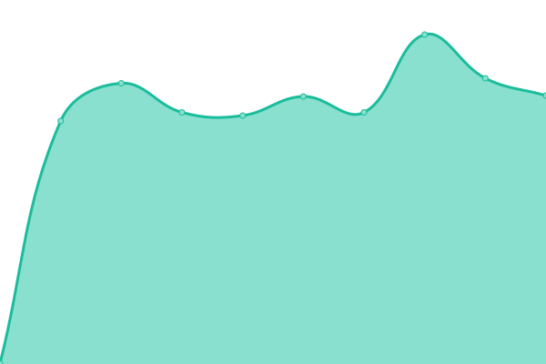
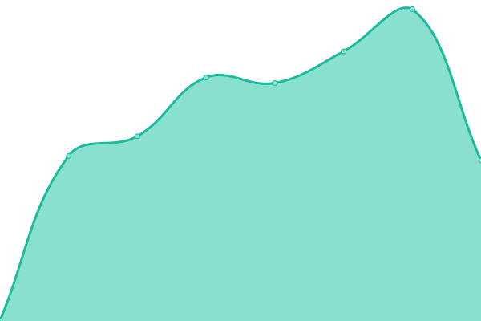

# [📈 Live Status](https://saizaax.github.io/upptime): <!--live status--> **🟩 All systems operational**

This repository contains the open-source uptime monitor and status page for [Korolkov Alexander](saizaax.dev), powered by [Upptime](https://github.com/upptime/upptime).

With [Upptime](https://upptime.js.org), you can get your own unlimited and free uptime monitor and status page, powered entirely by a GitHub repository. We use [Issues](https://github.com/saizaax/upptime/issues) as incident reports, [Actions](https://github.com/saizaax/upptime/actions) as uptime monitors, and [Pages](https://saizaax.github.io/upptime) for the status page.

<!--start: status pages-->
<!-- This summary is generated by Upptime (https://github.com/upptime/upptime) -->
<!-- Do not edit this manually, your changes will be overwritten -->
<!-- prettier-ignore -->
| URL | Status | History | Response Time | Uptime |
| --- | ------ | ------- | ------------- | ------ |
|  [saizaax.dev](https://saizaax.dev/) | 🟩 Up | [saizaax-dev.yml](https://github.com/saizaax/upptime/commits/HEAD/history/saizaax-dev.yml) | 

 542ms
     
 | 

<a href="https://saizaax.github.io/upptime/history/saizaax-dev">100.00%</a>
    

|  [uncos.saizaax.dev](https://uncos.saizaax.dev/) | 🟩 Up | [uncos-saizaax-dev.yml](https://github.com/saizaax/upptime/commits/HEAD/history/uncos-saizaax-dev.yml) | 

 423ms
     
 | 

<a href="https://saizaax.github.io/upptime/history/uncos-saizaax-dev">100.00%</a>
    

|  [pizza.saizaax.dev](https://pizza.saizaax.dev/) | 🟩 Up | [pizza-saizaax-dev.yml](https://github.com/saizaax/upptime/commits/HEAD/history/pizza-saizaax-dev.yml) | 

 527ms
     
 | 

<a href="https://saizaax.github.io/upptime/history/pizza-saizaax-dev">100.00%</a>
    

|  [xanity.saizaax.dev](https://xanity.saizaax.dev/) | 🟩 Up | [xanity-saizaax-dev.yml](https://github.com/saizaax/upptime/commits/HEAD/history/xanity-saizaax-dev.yml) | 

 412ms
     
 | 

<a href="https://saizaax.github.io/upptime/history/xanity-saizaax-dev">100.00%</a>
    

|  [schedule.saizaax.dev](https://schedule.saizaax.dev/) | 🟩 Up | [schedule-saizaax-dev.yml](https://github.com/saizaax/upptime/commits/HEAD/history/schedule-saizaax-dev.yml) | 

 425ms
     
 | 

<a href="https://saizaax.github.io/upptime/history/schedule-saizaax-dev">100.00%</a>
    

|  [docstorage.saizaax.dev](https://docstorage.saizaax.dev/) | 🟩 Up | [docstorage-saizaax-dev.yml](https://github.com/saizaax/upptime/commits/HEAD/history/docstorage-saizaax-dev.yml) | 

 402ms
     
 | 

<a href="https://saizaax.github.io/upptime/history/docstorage-saizaax-dev">100.00%</a>
    

<!--end: status pages-->

[**Visit our status website →**](https://saizaax.github.io/upptime)

## 📄 License

- Powered by: [Upptime](https://github.com/upptime/upptime)
- Code: [MIT](./LICENSE) © [Korolkov Alexander](saizaax.dev)
- Data in the `./history` directory: [Open Database License](https://opendatacommons.org/licenses/odbl/1-0/)
