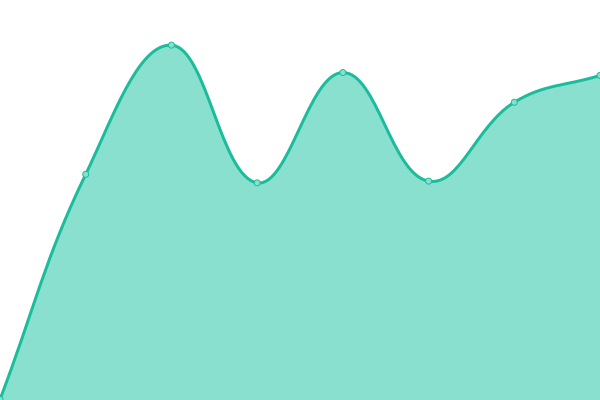
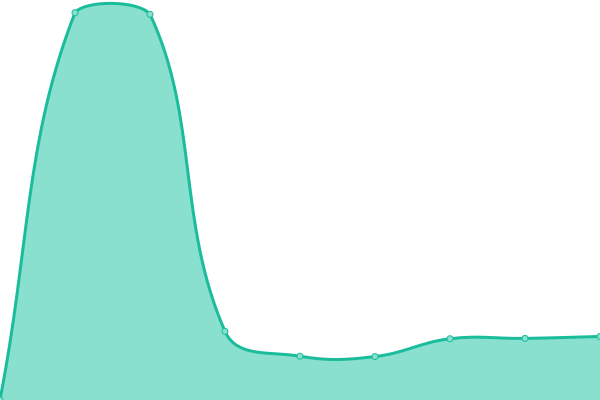

# [📈 Live Status](https://upptime.github.io/upptime): <!--live status--> **🟩 All systems operational**

This repository contains the open-source uptime monitor and status page for [Upptime](https://upptime.js.org), powered by [Upptime](https://github.com/upptime/upptime).

With [Upptime](https://upptime.js.org), you can get your own unlimited and free uptime monitor and status page, powered entirely by a GitHub repository. We use [Issues](https://github.com/upptime/upptime/issues) as incident reports, [Actions](https://github.com/saizaax/upptime/actions) as uptime monitors, and [Pages](https://upptime.github.io/upptime) for the status page.

<!--start: status pages-->
<!-- This summary is generated by Upptime (https://github.com/upptime/upptime) -->
<!-- Do not edit this manually, your changes will be overwritten -->
<!-- prettier-ignore -->
| URL | Status | History | Response Time | Uptime |
| --- | ------ | ------- | ------------- | ------ |
|  [saizaax.xyz](https://saizaax.xyz/) | 🟩 Up | [saizaax-xyz.yml](https://github.com/saizaax/upptime/commits/HEAD/history/saizaax-xyz.yml) | 

 832ms
     
 | 

<a href="https://saizaax.github.io/upptime/history/saizaax-xyz">100.00%</a>
    

|  [uncos.saizaax.xyz](https://uncos.saizaax.xyz/) | 🟩 Up | [uncos-saizaax-xyz.yml](https://github.com/saizaax/upptime/commits/HEAD/history/uncos-saizaax-xyz.yml) | 

 823ms
     
 | 

<a href="https://saizaax.github.io/upptime/history/uncos-saizaax-xyz">100.00%</a>
    

|  [pizza.saizaax.xyz](https://pizza.saizaax.xyz/) | 🟩 Up | [pizza-saizaax-xyz.yml](https://github.com/saizaax/upptime/commits/HEAD/history/pizza-saizaax-xyz.yml) | 

 801ms
     
 | 

<a href="https://saizaax.github.io/upptime/history/pizza-saizaax-xyz">100.00%</a>
    

|  [xanity.saizaax.xyz](https://xanity.saizaax.xyz/) | 🟩 Up | [xanity-saizaax-xyz.yml](https://github.com/saizaax/upptime/commits/HEAD/history/xanity-saizaax-xyz.yml) | 

 785ms
     
 | 

<a href="https://saizaax.github.io/upptime/history/xanity-saizaax-xyz">100.00%</a>
    

|  [schedule.saizaax.xyz](https://schedule.saizaax.xyz/) | 🟩 Up | [schedule-saizaax-xyz.yml](https://github.com/saizaax/upptime/commits/HEAD/history/schedule-saizaax-xyz.yml) | 

 794ms
     
 | 

<a href="https://saizaax.github.io/upptime/history/schedule-saizaax-xyz">100.00%</a>
    

<!--end: status pages-->

[**Visit our status website →**](https://upptime.github.io/upptime)

## 📄 License

- Powered by: [Upptime](https://github.com/upptime/upptime)
- Code: [MIT](./LICENSE) © [Upptime](https://upptime.js.org)
- Data in the `./history` directory: [Open Database License](https://opendatacommons.org/licenses/odbl/1-0/)
